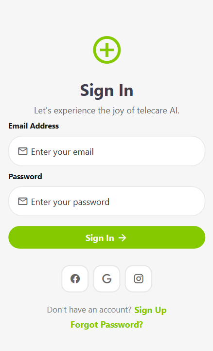

# Telecare AI Sign In UI

A modern and responsive Sign In UI built using React Native and Expo.  
This project focuses on clean UI design, reusable styling structure, and smooth user interaction.

---

## Tech Stack

- React Native
- Expo
- JavaScript
- React Hooks
- Expo Vector Icons

---

## Features

- Modern Sign In Screen
- Responsive Layout
- Input Focus Effects
- Social Login UI
- Clean Component Structure
- External CSS Styling Structure

---

## Screenshots



---

## Author

Ansh

GitHub: <https://github.com/Anshmittal86>

LinkedIn: <https://linkedin.com/in/Anshmittal86>

---

## Installation

Clone the repository:

```bash
git clone https://github.com/Anshmittal86/proj-signInUi-react-native-chaicode.git
```

Move into project folder:

```bash
cd proj-signInUi-react-native-chaicode
```

Install dependencies:

```bash
npm install
```

Start Expo server:

```bash
npx expo start
```
